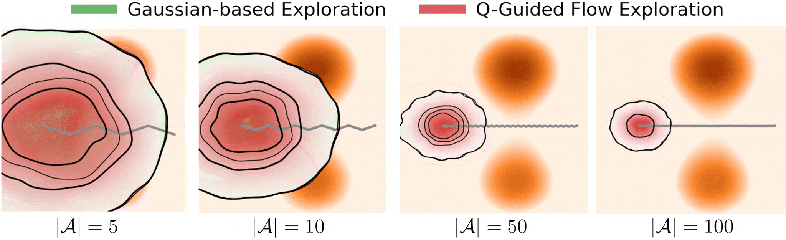
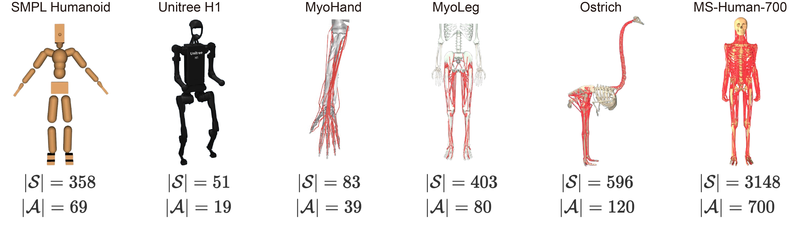
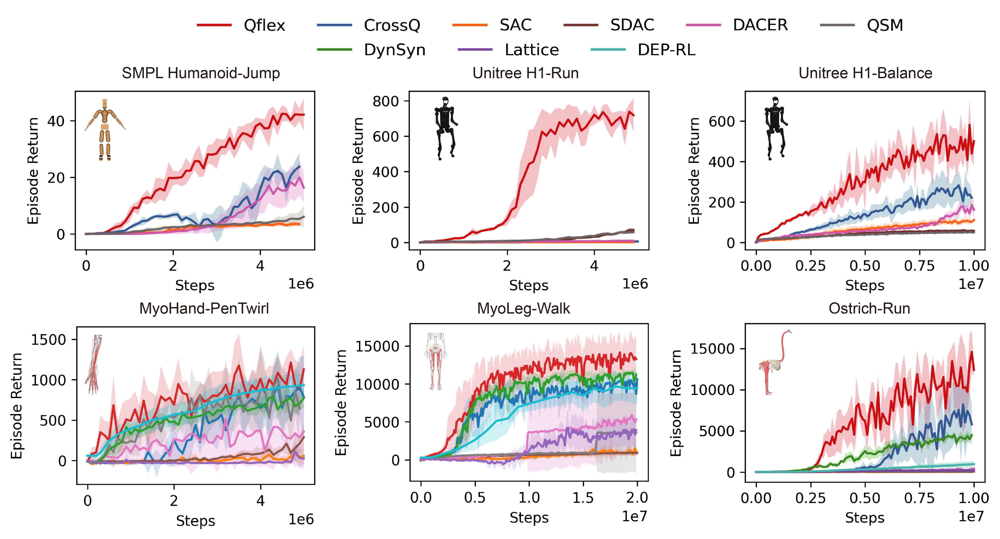

# Qflex: Scalable Exploration for High-Dimensional Continuous Control via Value-Guided Flow


Official implementation of [Q-guided flow exploration (Qflex)](https://arxiv.org/abs/2601.19707) algorithm at ICLR 2026.


<p align="center">
  
</p>

Qflex enables efficient control learning over various high-dimensional dynamical systems.

<p align="center">
  
</p>

<p align="center">
  
</p>

## Repository Layout

```text
relax/                         Core algorithms, networks, buffers, trainers
scripts/train.py               Main training entry point
requirements/uv/               uv requirement files for benchmark-specific environments
envs/smpl_humanoid/            Local wrapper for SMPLHumanoidJump-v1
envs/humanoid-bench            Git submodule: HumanoidBench
envs/ostrich/ostrichrl         Git submodule: OstrichRL
envs/ostrich/OstrichRun_v1.py  Local Gymnasium wrapper for OstrichRun-v1
envs/ms_700_walk/              Local wrapper for MS700Locomotion-v1
envs/ms_700_walk/MS-Human-700  Git submodule: local MS-Human-700 model assets
```

The environment repositories are tracked as submodules because several benchmarks require incompatible dependency
sets. Keep one Python environment per benchmark family.

## Clone

Clone with submodules:

```bash
git clone --recurse-submodules https://github.com/LNSGroup/Qflex.git
cd Qflex
```

If you already cloned without submodules:

```bash
git submodule update --init --recursive
```

## uv Setup

Install [uv](https://docs.astral.sh/uv/) if it is not already available:

```bash
curl -LsSf https://astral.sh/uv/install.sh | sh
```

The root package builds small native extensions under `src/`, so the Python used by `uv venv` must provide
development headers (`Python.h`). Conda Python and uv-managed Python usually work. If you use system Python on
Ubuntu/Debian, install the matching dev package, for example:

```bash
sudo apt-get install python3.12-dev build-essential
```

Shared Qflex dependencies are in `requirements/uv/base.txt`. JAX is split out because CPU and CUDA wheels differ:

- `requirements/uv/jax-cuda12.txt`
- `requirements/uv/jax-cpu.txt`

Use `jax-cuda12.txt` for GPU training. For CPU-only smoke tests, replace it with `jax-cpu.txt`.

## Environment Installation

Run commands from the repository root. The `UV_CACHE_DIR=.uv-cache` prefix keeps uv's cache inside the project.

### HumanoidBench

For `h1-run-v0` and `h1-balance_simple-v0`:

```bash
UV_CACHE_DIR=.uv-cache uv venv .venv/relax_humanoidbench --python 3.12 && \
UV_CACHE_DIR=.uv-cache uv pip install --python .venv/relax_humanoidbench \
  -r requirements/uv/jax-cuda12.txt \
  -r requirements/uv/relax_humanoidbench.txt
```

### SMPL Humanoid

For `SMPLHumanoidJump-v1`:

```bash
UV_CACHE_DIR=.uv-cache uv venv .venv/relax_smplhumanoid --python 3.12 && \
UV_CACHE_DIR=.uv-cache uv pip install --python .venv/relax_smplhumanoid \
  -r requirements/uv/jax-cuda12.txt \
  -r requirements/uv/relax_smplhumanoid.txt
```

### MyoSuite

For `myoHandPenTwirlRandom-v0` and `myoLegWalk-v0`:

```bash
UV_CACHE_DIR=.uv-cache uv venv .venv/relax_myosuite --python 3.12 && \
UV_CACHE_DIR=.uv-cache uv pip install --python .venv/relax_myosuite \
  -r requirements/uv/jax-cuda12.txt \
  -r requirements/uv/relax_myosuite.txt
```

### Ostrich and MS-Human-700 Walk

For `OstrichRun-v1` and `MS700Locomotion-v1`:

```bash
UV_CACHE_DIR=.uv-cache uv venv .venv/relax_ms --python 3.12 && \
UV_CACHE_DIR=.uv-cache uv pip install --python .venv/relax_ms \
  -r requirements/uv/jax-cuda12.txt \
  -r requirements/uv/relax_ms_700_walk.txt
```


Editable installs are encoded directly in the requirement files, for example:

```text
-e .
-e envs/humanoid-bench
-e envs/ostrich/ostrichrl
```

So `uv` replaces the old `pip install -e .` flow while still supporting editable local packages.

## Smoke Checks

Check that each benchmark imports with the matching venv Python:

```bash
.venv/relax_humanoidbench/bin/python -c "import humanoid_bench; print('humanoidbench ok')"
.venv/relax_smplhumanoid/bin/python -c "import envs; import gymnasium as gym; gym.make('SMPLHumanoidJump-v1'); print('smpl ok')"
.venv/relax_ms/bin/python -c "import envs; import gymnasium as gym; gym.make('MS700Locomotion-v1'); print('ms700 walk ok')"
.venv/relax_myosuite/bin/python -c "import myosuite; print('myosuite ok')"
```

If you use a plain `python` command, make sure the correct venv is activated first:

```bash
source .venv/relax_humanoidbench/bin/activate
which python
```

## Running Qflex

Common runtime environment variables:

```bash
export XLA_FLAGS='--xla_gpu_deterministic_ops=true'
export CUDA_VISIBLE_DEVICES=0
export MUJOCO_GL=egl
export XLA_PYTHON_CLIENT_PREALLOCATE=false
```

You can either activate the venv or call its Python directly. The examples below call the venv Python directly.

### HumanoidBench

```bash
.venv/relax_humanoidbench/bin/python scripts/train.py --alg qflex --env h1-run-v0 --seed 100 --total_step 5000000 --num_vec_envs 70 --record_video
.venv/relax_humanoidbench/bin/python scripts/train.py --alg qflex --env h1-balance_simple-v0 --seed 100 --total_step 20000000 --num_vec_envs 70 --record_video
```

### SMPL Humanoid

```bash
.venv/relax_smplhumanoid/bin/python scripts/train.py --alg qflex --env SMPLHumanoidJump-v1 --seed 100 --total_step 5000000 --num_vec_envs 80 --record_video
```

### MyoSuite

```bash
.venv/relax_myosuite/bin/python scripts/train.py --alg qflex --env myoHandPenTwirlRandom-v0 --seed 100 --total_step 5000000 --num_vec_envs 80 --record_video
.venv/relax_myosuite/bin/python scripts/train.py --alg qflex --env myoLegWalk-v0 --seed 100 --total_step 20000000 --num_vec_envs 80 --record_video
```


### Ostrich and MS-Human-700 Walk

```bash
.venv/relax_ms/bin/python scripts/train.py --alg qflex --env OstrichRun-v1 --seed 100 --total_step 10000000 --num_vec_envs 80 --record_video
.venv/relax_ms/bin/python scripts/train.py --alg qflex --env MS700Locomotion-v1 --seed 100 --total_step 50000000 --num_vec_envs 224 --hidden_dim 1024 --diffusion_hidden_dim 1024 --record_video
```


## Evaluating Saved Models

Use `scripts/evaluate.py` to evaluate one saved `policy-*.pkl` checkpoint directly. The script loads
`config.yaml` and `deterministic.pkl` from the same training run folder.

```bash
MUJOCO_GL=egl .venv/relax_myosuite/bin/python scripts/evaluate.py logs/myoLegWalk-v0/qflex_2026-05-01_00-51-05_s100_test_use_atp1/policy-1000000-12500.pkl --num_episodes 5 --seed 0
```

Evaluation outputs are written beside the model file:

```text
logs/<env>/<run>/eval_<timestamp>_<model_file_name>/
├── metrics.csv
├── summary.yaml
└── videos/
```

For quick metric-only checks, disable video recording:

```bash
.venv/relax_myosuite/bin/python scripts/evaluate.py <policy.pkl> --num_episodes 1 --seed 0 --no_video
```

## Baselines

Replace `--alg qflex` with one of:

```text
sdac, dacer, qsm, crossq, sac
```

For example:

```bash
.venv/relax_myosuite/bin/python scripts/train.py --alg sdac --env myoLegWalk-v0 --seed 100 --total_step 20000000 --num_vec_envs 80 --record_video
```

## Notes

- Logs are written under `logs/<env>/<alg>_<timestamp>...` by default.
- Add `--record_video` only when you want evaluator videos; otherwise the non-video evaluator is used.
- Qflex gradient construction can be tuned with `--grad_step_size` and `--grad_step_num`.
- If a benchmark import fails, first confirm you are using the matching venv Python, not the system Python.

## Related Methods

This codebase builds on [DACER](https://github.com/happy-yan/DACER-Diffusion-with-Online-RL.git) and
[SDAC](https://github.com/mahaitongdae/diffusion_policy_online_rl.git). Qflex and the baseline algorithms are
implemented under `relax/`, with benchmark environments kept under `envs/`.

For DynSyn, Lattice, and DEP-RL, follow the original repositories and match the paper appendix settings:

- DynSyn: https://github.com/Beanpow/DynSyn/tree/master/dynsyn
- Lattice: https://github.com/amathislab/lattice
- DEP-RL: https://github.com/martius-lab/depRL


## BibTex

```
@inproceedings{
wei2026scalable,
title={Scalable Exploration for High-Dimensional Continuous Control via Value-Guided Flow},
author={Wei, Yunyue and Zuo, Chenhui and Sui, Yanan},
booktitle={The Fourteenth International Conference on Learning Representations},
year={2026},
url={http://arxiv.org/abs/2601.19707}
}
```
